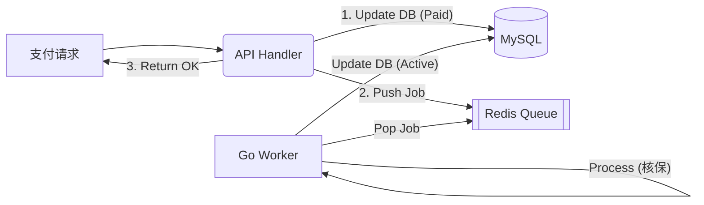

# InsurAI Platform (IAP) - 智能保险销售与咨询系统


## 1. 项目愿景与概述 (Overview)

**InsurAI Platform** 是一个高并发、现代化的保险电商后端系统。它旨在解决传统保险销售中“条款复杂、咨询难、出单慢”的痛点。

本项目不仅仅是一个电商 Demo，更是对 **Go 高级工程实践** 的探索。核心目标是展示：
1.  **架构演进**：采用 **Modular Monolith (模块化单体)** 结合 **Clean Architecture**，在保持开发效率的同时实现模块解耦。
2.  **AI 原生集成**：利用字节跳动 **CloudWeGo/Eino** 框架编排 RAG (检索增强生成) 流程，实现基于真实保单条款的智能咨询。
3.  **高并发与异步设计**：通过 Go Channel 和 Redis 实现订单的异步核保与状态机流转。

---

## 2. 系统架构 (System Architecture)

### 2.1 顶层设计：模块化单体 (Modular Monolith)
为了避免微服务带来的分布式复杂性（网络延迟、数据一致性），本项目采用模块化单体架构。各业务模块（User, Product, Order, Agent）在代码层面严格隔离，仅通过接口通信。

*   **接入层 (Interface)**: RESTful API (Gin), Swagger 文档。
*   **应用层 (Application)**: 业务编排，事务控制。
*   **领域层 (Domain)**: 核心业务实体与接口定义 (Pure Go)。
*   **基础设施层 (Infrastructure)**: MySQL, Redis, Qdrant, Eino, Python ETL。

### 2.2 目录结构 (Clean Architecture)

遵循 `golang-standards/project-layout` 规范：

```text
insur-ai-platform/
├── cmd/server/            # 程序入口 (依赖注入/Wiring)
├── configs/               # 环境配置
├── scripts/               # Python ETL (离线数据处理)
├── internal/
│   ├── infrastructure/    # 数据库、Redis、Eino 客户端实现
│   └── modules/           # 业务模块拆分
│       ├── agent/         # [核心] AI 顾问模块
│       ├── order/         # [核心] 订单与异步 Worker
│       ├── product/       # 产品管理 (半结构化数据)
│       └── user/          # 用户认证
└── pkg/                   # 通用工具库 (Logger, ErrResponse)
```

---

## 3. 核心技术栈 (Tech Stack)

| 领域 | 技术选型 | 决策理由 (Decision Log) |
| :--- | :--- | :--- |
| **语言** | **Go 1.21+** | 高并发性能，强类型安全。 |
| **Web 框架** | **Gin** | 极致的路由性能，社区生态成熟。 |
| **AI 编排** | **CloudWeGo/Eino** | **(亮点)** 相比 LangChainGo，Eino 提供了更强类型的 Graph 编排能力和流式处理支持，适合生产级 RAG。 |
| **向量检索** | **Qdrant** | Rust 编写的高性能向量数据库，Docker 部署轻量且支持高级过滤。 |
| **数据库** | **MySQL 8.0** | 核心业务数据存储，利用 JSON 类型存储异构保单权益。 |
| **缓存/队列** | **Redis** | 对话历史 (Session Memory) 及订单异步任务队列。 |
| **数据清洗** | **Python (Scripts)** | 利用 Python 丰富的 NLP 生态处理 PDF 解析与 Embedding (离线链路)。 |

---

## 4. 关键功能与实现细节 (Key Features)

### 4.1 智能保险顾问 (AI Agent with RAG)
基于 **RAG (Retrieval-Augmented Generation)** 架构，解决 LLM 在专业领域“胡说八道”的问题。

*   **离线链路 (Python)**:
    1.  使用 `Qwen-VL` 将复杂的保险 PDF 解析为 Markdown。
    2.  进行语义切片与清洗。
    3.  调用 Embedding API 生成向量并写入 **Qdrant**。
*   **在线链路 (Go + Eino)**:
    1.  **Graph Orchestration**: 使用 Eino 定义 `Retriever -> PromptTemplate -> ChatModel` 的有向无环图。
    2.  **Vector Search**: 检索 Top-K 相关条款。
    3.  **Streaming**: 通过 Server-Sent Events (SSE) 流式返回答案，降低用户感知延迟。

### 4.2 异构产品模型 (Semi-structured Product)
保险产品非标准化（意外险 vs 医疗险字段完全不同）。
*   **设计**: MySQL `products` 表使用 `JSON` 字段存储 `features`。
*   **优势**: 兼顾了关系型数据库的事务能力和 NoSQL 的灵活性。

### 4.3 异步订单处理 (Async Order Processing)
模拟真实保险核保流程，避免 HTTP 接口长时间阻塞。
*   **流程**: 用户支付 -> 状态置为 `Paid` -> 写入 Redis 队列 -> 立即返回。
*   **Worker**: 后台 Goroutine 消费队列 -> 执行核保逻辑 (Mock) -> 生成保单号 -> 更新库状态为 `Active`。
*   **并发模型**: 使用 Go 原生 `Worker Pool` 模式控制并发度。

---

## 5. API 接口规范 (API Specification)

本项目对外提供标准的 **RESTful API**，并集成 Swagger UI。

| 模块 | 方法 | 路径 | 描述 |
| :--- | :--- | :--- | :--- |
| **Auth** | POST | `/api/v1/auth/login` | 获取 JWT Token |
| **Agent** | POST | `/api/v1/agent/chat` | 与 AI 顾问对话 (RAG) |
| **Product** | GET | `/api/v1/products` | 检索保险产品列表 |
| **Product** | GET | `/api/v1/products/{id}` | 获取产品详情 |
| **Order** | POST | `/api/v1/orders` | 创建订单 |
| **Order** | POST | `/api/v1/orders/{id}/pay` | 支付订单 (触发异步核保) |
| **Order** | GET | `/api/v1/orders/{id}` | 轮询订单状态 (Polling) |

---

## 6. 数据流图 (Data Flow)

### 6.1 RAG 检索流程
```mermaid
graph LR
    A[用户提问] --> B(Go API / Eino)
    B --> C{Qdrant 向量库}
    C -- 检索条款片段 --> B
    B -- 组装 Prompt --> D[LLM (OpenAI/DeepSeek)]
    D -- 生成回答 --> A
```

### 6.2 异步出单流程


---

## 7. 快速开始 (Getting Started)

### 前置要求
*   Go 1.21+
*   Docker & Docker Compose
*   Python 3.10+ (仅用于数据初始化)
*   OpenAI / DeepSeek API Key

### 运行步骤

1.  **启动基础设施**
    ```bash
    docker-compose up -d
    # 启动 MySQL, Redis, Qdrant
    ```

2.  **数据初始化 (ETL)**
    *   将你的 PDF/MD 文件放入 `scripts/data/raw`。
    *   运行 Python 脚本进行向量化入库：
    ```bash
    cd scripts
    pip install -r requirements.txt
    python etl_pipeline.py
    ```

3.  **启动后端服务**
    ```bash
    # 确保 configs/config.yaml 已配置 API Key
    go mod tidy
    go run cmd/server/main.go
    ```

4.  **接口测试**
    *   打开浏览器访问 Swagger UI: `http://localhost:8080/swagger/index.html`

---

## 8. 未来规划 (Future Roadmap)

*   [ ] **微服务拆分**: 当单体复杂度上升时，利用 go-zero 将 `Agent` 模块独立拆分为 gRPC 服务。
*   [ ] **多模态 RAG**: 扩展 Eino Graph，支持图片（保险理赔单据）的理解与分析。
*   [ ] **分布式事务**: 在订单拆分后，引入 Saga 模式处理分布式一致性。
